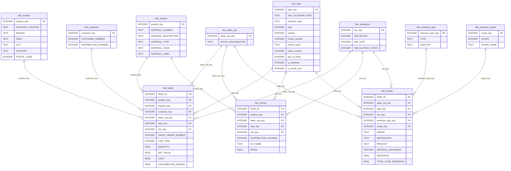

# SAIES Warehouse ERD

This ERD reflects the live SQLite warehouse generated by `etl_star_schema.py` and the production-oriented MySQL DDL in `mysql/saies_warehouse_schema.sql`.

## Fact grains

| Fact table | Grain |
|---|---|
| `fact_sales` | One row per sales order line item from `Sales.xlsx`. |
| `fact_pricing` | One row per product, sales organization, distribution channel, and simulation date price condition from `Prices.xlsx`. |
| `fact_carbon` | One row per carbon emissions activity event from `Carbon Emissions.xlsx`. |

## Modeling notes

- `dim_date` is a real calendar dimension with simulation fields retained for the ERPSIM context.
- All fact foreign keys are declared in SQLite and indexed.
- `dim_emission_type` and `dim_emission_scope` normalize repeated carbon descriptors.
- `fact_carbon.PRODUCT` remains a degenerate product-family code such as `T01`; it is not forced into `dim_product` because `dim_product` is materially more specific by organization/material number.
