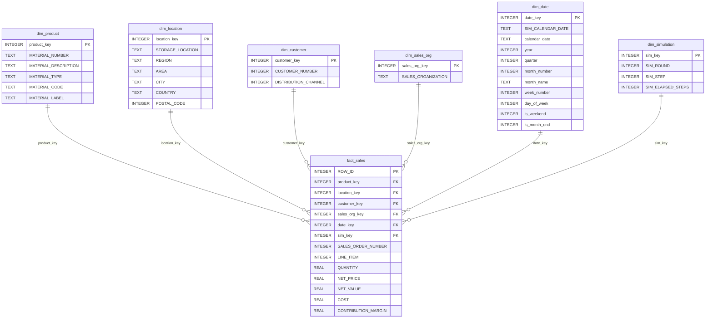
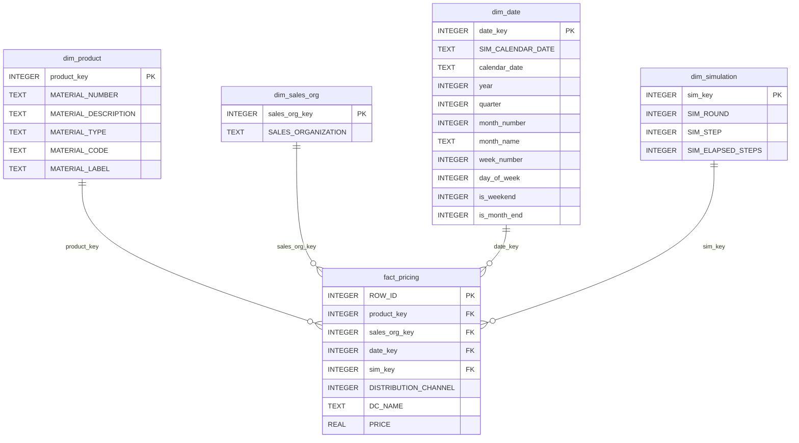
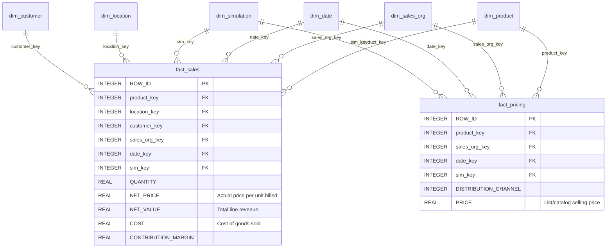

# SAIES Warehouse ERD — Sales & Pricing

This ERD covers the Sales and Pricing tables of the SAIES warehouse.
The full schema (including Carbon) is in `mysql/saies_warehouse_schema.sql`
and the `.mwb` MySQL Workbench model.

---

## Diagram 1 — Sales Star Schema

`fact_sales` sits at the centre. Each row is one sales order line item from `Sales.xlsx`.
Five dimensions describe who sold what, where, to whom, and when.

---

## Diagram 2 — Pricing Star Schema

`fact_pricing` records the **selling/list price** for each product per sales organisation,
distribution channel, and simulation date — sourced from the `Pricing_Conditions` sheet.
This is the price the company charges customers, not the cost to produce the product
(cost is `COST` in `fact_sales`).

---

## Diagram 3 — Combined Sales & Pricing (How They Join)

`fact_sales` and `fact_pricing` share four dimensions and are joined by the application
on `MATERIAL_NUMBER + DISTRIBUTION_CHANNEL + SIM_CALENDAR_DATE` to match each sale
with its corresponding list price.

---

## Price fields explained

| Field | Table | What it means |
|---|---|---|
| `PRICE` | `fact_pricing` | List/catalog selling price set in the ERP pricing conditions |
| `NET_PRICE` | `fact_sales` | Actual price per unit charged in a specific sales order |
| `COST` | `fact_sales` | Cost of goods sold per unit (not a selling price) |

`PRICE` and `NET_PRICE` are not redundant — `PRICE` is the reference price from the pricing
master, while `NET_PRICE` is what was actually billed (which can differ due to discounts).
`COST` is entirely separate and represents the production/acquisition cost, not a customer price.

---

## Fact grains

| Fact table | Grain |
|---|---|
| `fact_sales` | One row per sales order line item from `Sales.xlsx` |
| `fact_pricing` | One row per product, sales organisation, distribution channel, and simulation date from `Prices.xlsx` |
